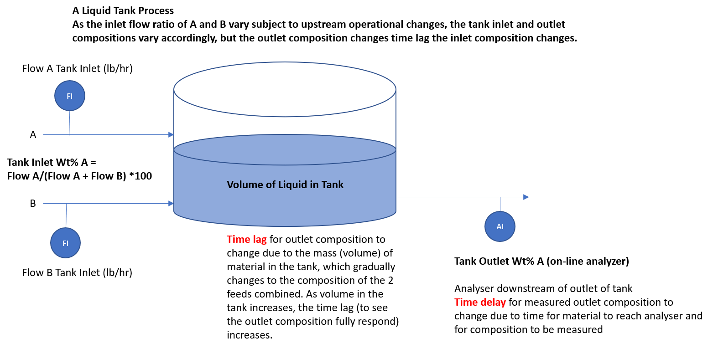
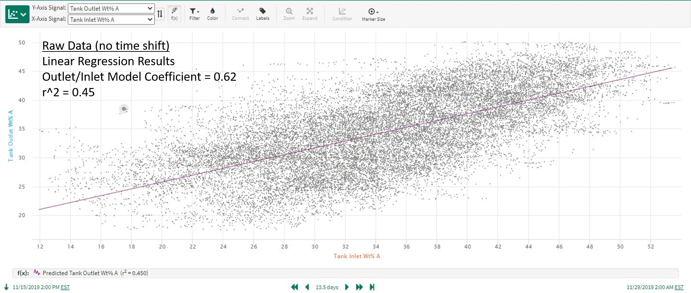
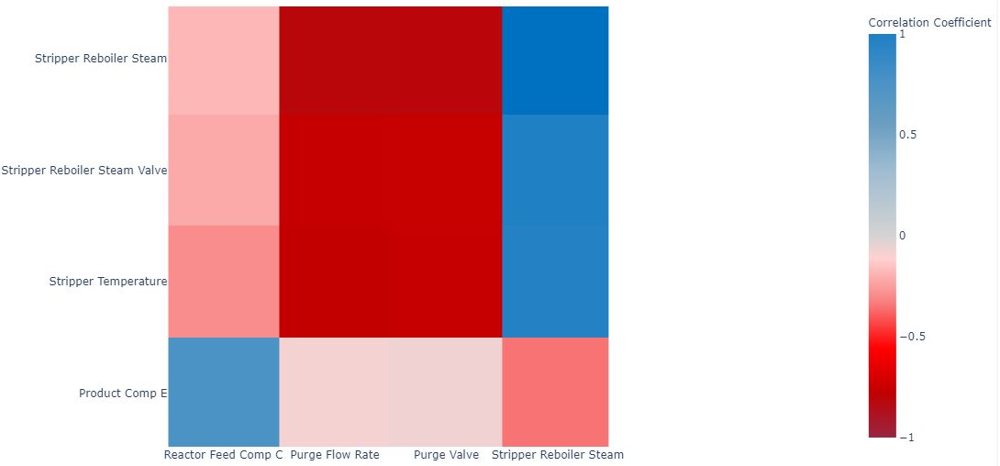

# User Guide

<table border="0">
<td></td>
</table>

## Overview

A general overview of the motivation for and benefits and functionality of the correlation analysis, as implemented in
**seeq-correlation** is provided in this section.

### Why Linear Regression Models for Pairs of Signals Are Not Always Adequate

Insightful relationships can be difficult to discover in time-series datasets involving large numbers of signals,
measurement noise, and time lags. Standard prediction modeling often falls short when signal relationships involve time
lagged process dynamic responses. Consider the tank process shown in the diagram in Figure 1. In this example, the tank
liquid outlet composition (Tank Outlet Wt% A) is highly correlated to the ratio of the liquid feeds entering the tank,
but the tank outlet composition does not change instantly to the steady operation value following inlet feed ratio
changes. Instead, the measured tank outlet composition changes are time delayed due to analyzer processing, and also
change gradually over time due to the volume of liquid inventory (see the Tank Outlet Wt% A trend in Figure 2). This is
a process dynamic response which involves time delayed and time lagged correlations. Standard prediction modeling to
correlate the tank inlet and outlet compositions will give misleading results about the strength of the correlation.
**The frequent occurrence of time delay and time lagged responses in process data is why correlation analysis is a
necessary analytics tool and is sometimes needed in addition to prediction modeling.**

 
<table border="0">
 <tr>
    <td></td>
 </tr>
 <tr>
    <td>Figure 1. Example of a tank process with two liquid feeds and one outlet.</td>
 </tr>
</table>
  
<table border="0">
 <tr>
    <td></td>
 </tr>
 <tr>
    <td>Figure 2. Flow rates of the feeds and tank outlet composition (wt%) for the process in Figure 1.</td>
 </tr>
</table>
  

As you can see in Figure 3, data from a longer time period for the process above shows a relatively weak correlation
between the inlet and outlet compositions, and a linear prediction model applied to this data gives misleading results.
Correlation analysis leads to much better results, as shown in Figure 4 where the "Tank Outlet Wt% A" signal has been
time shifted based on the maximized correlation time shift determined from the correlation application (see [**Use Case
4**](examples.html#use-case-4-quantifying-relationships-and-the-importance-of-preprocessing-the-data) below for
additional details).

 
<table border="0">
 <tr>
    <td></td>
 </tr>
 <tr>
    <td>Figure 3. Linear regression model using raw data as inputs.</td>
 </tr>
</table>
  
<table border="0">
 <tr>
    <td></td>
 </tr>
 <tr>
    <td>Figure 4. Linear regression model using time shifted data as inputs.</td>
 </tr>
</table>
  

### The Mechanics and Benefits of **seeq-correlation**

How is the correlation analysis conducted in **seeq-correlation** and how does it overcome the limitations of standard
linear regression models predicting one signal based on another?

Correlation analysis is conducted by time shifting each signal relative to the signal is it being compared against, and
calculating the cross-correlation between the 2 signals over a range of positive and negative time shifts. The
correlation coefficient for signal 2 relative to signal 1 (at a given time shift) is equivalent to doing a linear, least
squares regression model using the original data for signal 1 and using signal 2's data time shifted by the specified
amount. The coefficient computed by the Correlation Analysis is equivalent to r, where r^2 is the typical "
goodness-of-fit" value reported for a prediction model. In effect, the analysis performs many standard linear regression
prediction models (one for each time shift) for each pair of signals in the dataset. A key feature is that the analysis
identifies and displays the time shift which maximizes the absolute correlation between the 2 signals. Keep in mind that
the strongest correlation could be a negative or inverse type. **As a result, Correlation Analysis identifies the best
correlation between 2 signals in the presence of time shift and time lag effects, and quantifies the amount of lead or
lag time in the signal relationship. This enables the user to discover meaningful process insights difficult to obtain
from visual inspection of time trends, and to accurately quantify causes of process variation.**

The Correlation Analysis is displayed in a "heatmap correlation matrix" summarizing the pairwise correlations and time
shifts for each combination of signals in the dataset (see example in Figure 5). In the heatmap, blue represents a high
direct (positive) correlation while red represents a high indirect (negative) correlation between the two signals. The
user can optionally choose to display the maximized, time-shifted correlations or the standard linear regression
correlation with no time shift involved. The heatmap is interactive to provide the computed correlation value when
hovering above an individual cell.

 
<table border="0">
 <tr>
    <td></td>
 </tr>
 <tr>
    <td>Figure 5. Example of correlation analysis from <strong>seeq-correlation</strong>.</td>
 </tr>
</table>
  

### Correlation Analysis Functionality and Uses

To summarize, while strong correlations do happen almost simultaneously among some signals in manufacturing processes,
it is also very common to have delayed (dynamic) responses similar to the example above. These dynamic responses occur
for a variety of reasons: liquid volumes, natural mechanical or transport delays, sampling systems, thermal mass, etc.
We can use **seeq-correlation** to identify correlations of both types, those involving dynamic responses as well as the
more familiar simultaneous correlations typically identified via standard prediction models. Features and benefits of
correlation analysis include:

* Identifying signal correlations in the absence or presence of process dynamics (time lags)
* Quantifying time shifts which maximize cross-correlation between signals. Simultaneous correlation relationships will
  simply result in maximum correlations at or near time shifts equal to 0.
* Displaying results by correlation coefficient or by time shift, as well as creating optimally shifted signals for
  additional analysis
* Visualizing correlations for an entire dataset in one view (fast, initial analysis of large datasets)
* Simplifying dataset analysis by removing uncorrelated signals (condensing a large dataset for further analysis)
* Discovering non-obvious relationships affecting process performance, including upsets or cycles affecting large
  portions of the process
* Increasing the value realized through predictive analytics

## How to Use

Correlation analysis is launched from within Seeq Workbench after creating the "dataset" for analysis by adding signals
to the trends. Correlation analysis is performed on a single worksheet basis and includes all the trended signals.

### Workflow

1. Add all relevant dataset signals to trend view. Set the time range as desired. The time range should be long enough
   to capture significant variation in the signals, so that any meaningful correlations can be detected.
2. Do any necessary pre-processing (Question: do we need to avoid gaps in the data such as those that might be found if
   there is a shutdown in between runs?) such as removing outliers, signal smoothing, and other adjustments. It is
   important at this step to properly cleanse the data prior to running the correlation analysis. See [**Use Case
   3**](examples.html#use-case-2-large-dataset-exploration)
   below for additional information.
3. From the Tools tab in Workbench, select External Tools followed by Correlation Analysis.
4. The correlation analysis now proceeds and when it is finished the correlation matrix, the cross-correlations for each
   pair of signals in the dataset, appears. By default, the correlations are shown for the time shift which maximizes
   the correlation between each pair of signals. Of course, time shifts can be turned OFF, in which case you are viewing
   the pairwise correlations with no time shift.
5. From this point, you have many options for displaying and examining the correlation results. Options include (see
   corresponding locations in Figure 6):
    1. Turning time shifts on/off (defaults to ON)
    2. Specifying the maximum time shift (defaults to auto)
    3. Displaying the correlation matrix colors based on coefficients (default) or time shifts
    4. Displaying the output as a heatmap (default) or a table
    5. Filtering the display of matrix cells based on coefficient or time shift ranges
    6. Using interactive display controls to zoom, pan, add spike lines, save as image, etc.
    7. Create shifted versions of the signals in the dataset. The time shift is calculated to maximize the correlation
       of each signal with a user-specified target signal. The shifted signals are written to the worksheet and
       available in Seeq as new signals. One application for this is creating shifted versions of signals to use as
       inputs for prediction models.
        
        <table border="0">
         <tr>
            <td></td>
         </tr>
         <tr>
            <td>Figure 6. Options for displaying and examining the correlation results.</td>
         </tr>
        </table>
         
   For example, you may want to use zooming controls (see 5f above) to highlight a section of the correlation matrix and
   focus on a subset of relationships (see Figure 7), or zoom to a single row or column to see all the impacts on a
   critical signal of interest.
    
   <table border="0">
   <tr>
   <td></td>
   </tr>
   <tr>
   <td>Figure 7. Example of using the zoom controls to focus on a subset of relationships.</td>
   </tr>
   </table>
    
6. When you are finished with the correlation analysis, you may wish to create shifted signals for additional
   investigation in Workbench, save the correlation analysis image for reference, etc. You can, of course, continue to
   iterate on the dataset used for the correlation analysis and perform additional analyses with a modified set of
   signals, different time ranges, etc.

